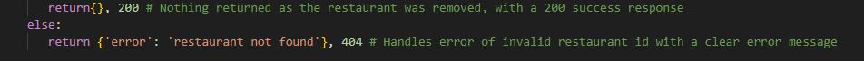
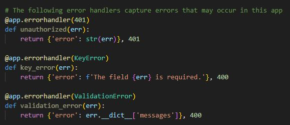
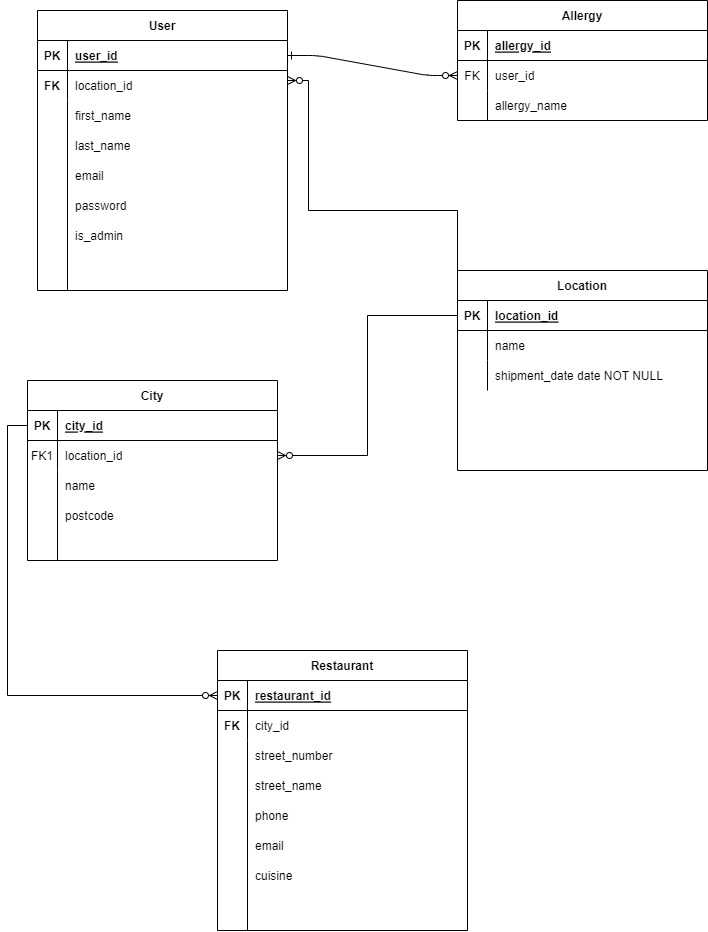
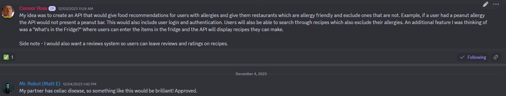
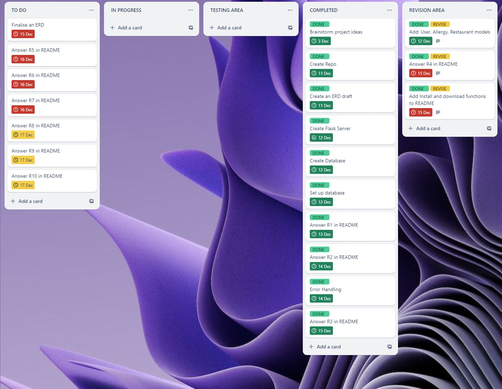
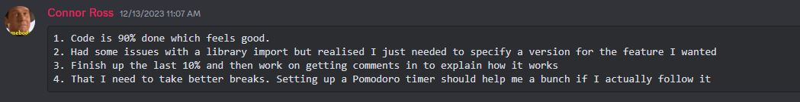

# Flask App Installation Guide

## Prerequisites
Make sure you have the following installed on your system:
- [Python](https://www.python.org/) (version 3.6 or higher)
- [pip](https://pip.pypa.io/en/stable/installation/) (Python package installer)

## Instructions on how to set up application:

Provided is a sample .env file, but a personal postgresql uri and jwt secret key must be provided for the application to work.

Through terminal, connect to the PostgreSQL database:

`psql`

Create a database that you will use for the API (I named it picknik)

`CREATE DATABASE picknik;`

Connect to the database:

`\c picknik`

Create a user and password:

`CREATE USER admin WITH PASSWORD admin;`

Grant the created user with all access privileges

`GRANT ALL PRIVILEGES ON picknik TO admin;`

Quit out of Postgres by using:

`\q`

Change directory to /src folder, then run commands in terminal below:

`python3 -m venv .venv`

`source .venv/bin/activate`

`pip install -r requirements.txt`

In order to create tables, run:

`flask db create`

Populate the tables with:

`flask db seed`

Run the server by running the following command:

`flask run`

### Requirement 1 - Identify the problem you are trying to solve with this app
Creating this app aims to tackle a range of challenges faced by people with allergies. For those with specific dietary restrictions, finding restaurants that cater to their needs can be a real struggle, occassionally even leading to health risks from accidental allergen consumption. The app comes as a solution, making it easier for users to discover restaurants offering allergen-free or allergy-friendly options. Beyond just health concerns, it aims to simplify the often time-consuming process of researching and contacting restaurants for allergy information, providing a user-friendly experience. It also supports allergy-friendly restaurants by increasing their visibility and fostering a sense of community among users with similar dietary restrictions. In essence, this app not only addresses health-related challenges but also seeks to improve accessibility, convenience, and community engagement for individuals with dietary restrictions.

### Requirement 2 - Why is it a problem that needs solving
The need to address the challenges faced by individuals with allergies is paramount due to the severity and prevalence of allergic reactions, which can lead to hospitalizations and, in extreme cases, fatalities. According to the Centers for Disease Control and Prevention (CDC), food allergies result in over 200,000 emergency room visits annually in the United States alone. Additionally, a study published in the Journal of Allergy and Clinical Immunology estimates that food allergies affect approximately 32 million Americans, including 5.6 million children, with an increasing trend observed over the years. 

[Source](https://matsui.house.gov/media/press-releases/matsui-gallagher-lead-effort-highlight-benefits-early-introduction-food#:~:text=Food%20allergies%20impact%20an%20estimated,requiring%20emergency%20medical%20treatment%20annually)

The consequences of accidental allergen exposure can range from mild discomfort to life-threatening anaphylaxis. Anaphylaxis is a severe allergic reaction that can cause a rapid drop in blood pressure, difficulty breathing, and, if not treated promptly, can be fatal. The Asthma and Allergy Foundation of America reports that anaphylaxis results in an estimated 1,500 deaths in the United States annually.

Given the substantial impact of allergies on public health and the potential for severe consequences, a dedicated app that helps users easily identify allergy-friendly restaurants is essential. By providing accurate and accessible information about allergen-free menu options, the app contributes to reducing the risk of allergic reactions and related hospitalizations. The ultimate goal is to enhance the safety, well-being, and overall quality of life for individuals managing allergies.

### Requirement 3 - Why Choose PostgreSQL? What are the drawbacks compared to others?

Selecting PostgreSQL as the go-to database system brings with it some notable benefits, but like any choice, it isn't without its drawbacks. On the positive side, PostgreSQL is an open-source platform, making it not only cost-effective but also customizable to suit project needs. Renowned for its robustness, this system ensures data integrity even in the face of system failures, thanks to its adherence to ACID principles. PostgreSQL is highly extensible, allowing developers the freedom to create tailored functions, data types, and operators. Its support for diverse data types, scalability, and an active community further contribute to its popularity. However, navigating PostgreSQL may pose a steeper learning curve for those accustomed to other databases. Performance, particularly in comparison to databases like MySQL or NoSQL options, can be subjective to the use case. Additionally, while PostgreSQL offers replication features, some databases provide more straightforward built-in tools for replication setup. In essence, the choice between PostgreSQL and other systems hinges on the unique requirements of a project, considering factors such as performance, ease of use, database knowledge and available features.

### Requirement 4 - Identify and discuss the key functionalities and benefits of an ORM

Object-Relational Mapping (ORM) serves as a crucial facilitator in bridging the gap between databases and applications by abstracting the intricacies of database operations into a more intuitive, object-oriented model. With ORM, developers can interact with databases using the paradigm of classes and objects, simplifying the code and aligning it closely with the logic of the application. This abstraction also offers portability, enabling developers to switch between different database systems with minimal code adjustments. ORM significantly enhances productivity and accelerates development cycles by simplifying CRUD operations and reducing boilerplate code. The framework promotes code reusability, maintains clean separation between business logic and database interactions, and often automates query generation, minimizing the risk of SQL injection vulnerabilities. Additionally, ORM contributes to maintainability, providing tools for managing database schemas, handling concurrency control, and seamlessly integrating the database with the application's business logic. While ORM introduces some performance overhead, its advantages in terms of productivity and code organization make it a valuable asset in modern application development.

### Requirement 5 - Document all Endpoints

#### User Routes (/users)

1. /users/

Method: GET

Description: Retrieve a list of all users, excluding passwords (admin access only).

Authorization: Requires a valid JWT token with admin privileges.

Response:

200 OK: Returns a list of user objects excluding their passwords.
401 Unauthorized: If the request is not authorized as an admin.

2. /users/{user_id}

Methods: PUT, PATCH

Description: Update a user's information.

Authorization: Requires a valid JWT token with admin privileges or the user themselves.

Request: Accepts JSON data with optional fields for updating user information.

Response:

200 OK: Returns the updated user object excluding the password.

404 Not Found: If the specified user ID does not exist.

401 Unauthorized: If the request is not authorized as an admin or the user themselves.

3. /users/{user_id}

Method: DELETE

Description: Delete a user.

Authorization: Requires a valid JWT token with admin privileges or the user themselves.

Response:

200 OK: If the user is successfully deleted.

404 Not Found: If the specified user ID does not exist.

401 Unauthorized: If the request is not authorized as an admin or the user themselves.

#### Restaurants Routes

1. /restaurants/

Method: GET

Description: Retrieve a list of all restaurants.

Response:

200 OK: Returns a list of restaurant objects excluding the location ID.

404 Not Found: If no restaurants are found.

2. /restaurants/{restaurant_id}

Method: GET

Description: Retrieve information for a specific restaurant.

Response:

200 OK: Returns the restaurant object excluding the ID and location ID.

404 Not Found: If the specified restaurant ID does not exist.

3. /restaurants/

Method: POST

Description: Create a new restaurant.

Authorization: Requires a valid JWT token.

Request: Accepts JSON data with required fields for creating a new restaurant.

Response:

201 Created: Returns the created restaurant object excluding the location ID.

400 Bad Request: If there are issues with the request body.

401 Unauthorized: If the request is not authorized.

4. /restaurants/{restaurant_id}

Method: PUT, PATCH

Description: Update a restaurant's information.

Authorization: Requires a valid JWT token.

Request: Accepts JSON data with optional fields for updating restaurant information.

Response:

200 OK: Returns the updated restaurant object excluding the location ID.

404 Not Found: If the specified restaurant ID does not exist.

400 Bad Request: If there are issues with the request body.

401 Unauthorized: If the request is not authorized.

5. /restaurants/{restaurant_id}

Method: DELETE

Description: Delete a restaurant.

Authorization: Requires a valid JWT token.

Response:

200 OK: If the restaurant is successfully deleted.

404 Not Found: If the specified restaurant ID does not exist.

401 Unauthorized: If the request is not authorized.

#### Authentication Routes:

1. /auth/sign_up

Method: POST

Description: Register a new user.

Request: Accepts JSON data with required fields for user registration.

Response:

201 Created: Returns the created user object excluding the password.

400 Bad Request: If there are issues with the request body.

409 Conflict: If the email address is already in use.

2. /auth/login

Method: POST

Description: Login with email and password.

Request: Accepts JSON data with email and password for user login.

Response:

200 OK: Returns a JWT token and user object excluding the password.

401 Unauthorized: If the email or password is invalid.

400 Bad Request: If the email and password are not provided.

#### Allergy Routes

1. /allergies/

Method: GET

Description: Retrieve a list of all allergies.

Response:

200 OK: Returns a list of allergy objects excluding the location ID.

404 Not Found: If no allergies are found.

2. /allergies/{allergy_id}

Method: GET

Description: Retrieve information for a specific allergy.

Response:

200 OK: Returns the allergy object excluding the ID and location ID.

404 Not Found: If the specified allergy ID does not exist.

3. /allergies/

Method: POST

Description: Create a new allergy.

Authorization: Requires a valid JWT token.

Request: Accepts JSON data with required fields for creating a new allergy.

Response:

201 Created: Returns the created allergy object excluding the location ID.

400 Bad Request: If there are issues with the request body.

401 Unauthorized: If the request is not authorized.

4. /allergies/{allergy_id}

Method: PUT/PATCH

Description: Update an allergy's information.

Authorization: Requires a valid JWT token.

Request: Accepts JSON data with optional fields for updating allergy information.

Response:

200 OK: Returns the updated allergy object excluding the location ID.

404 Not Found: If the specified allergy ID does not exist.

400 Bad Request: If there are issues with the request body.

401 Unauthorized: If the request is not authorized.

5. /allergies/{allergy_id}

Method: DELETE

Description: Delete an allergy.

Authorization: Requires a valid JWT token.

Response:

200 OK: If the allergy is successfully deleted.

404 Not Found: If the specified allergy ID does not exist.

401 Unauthorized: If the request is not authorized.

#### Error Handling

The Flask application incorporates a robust error handling system to provide informative and user-friendly responses in various exceptional scenarios. For instance, when attempting to access or modify resources such as users, restaurants, or allergies that do not exist, the application responds with a clear "Not Found" message and a corresponding HTTP 404 status code. Additionally, the system handles scenarios like attempting to create a new user with an email address already in use or creating a restaurant with an invalid location ID, delivering appropriate responses with distinct HTTP status codes such as 409 Conflict or 400 Bad Request, respectively. Furthermore, when user login attempts fail due to incorrect credentials or missing email/password information, the application issues a concise and accurate error message alongside a 401 Unauthorized status code. Lastly, to ensure secure data access, the system requires the appropriate privileges (admin or user ownership) and responds with a 401 Unauthorized status if those conditions are not met. This comprehensive approach to error handling enhances the API's usability by guiding users through potential issues and facilitating effective issue resolution. Images are linked below which provide examples of how error handling was used in the app.

### Requirement 6 - ERD

The ERD for the application represents the data model in a relational database, capturing the essential entities, attributes, and relationships. The primary entities include:

* User:

Represents individuals using the application.
Attributes: user_id, first_name, last_name, email, password, is_admin, location_id.

* Location:

Denotes geographical locations relevant to the application.
Attributes: location_id, name.

* City ( I am using this synonymously with suburbs to reduce confusion):

Corresponds to cities with associated postcodes.
Attributes: city_id, name, postcode, location_id.

* Restaurant:

Represents dining establishments featured in the application.
Attributes: restaurant_id, name, street_number, street_name, phone, email, description, cuisine, city_id.

* Allergy:

Captures information about specific allergies.
Attributes: allergy_id, allergy_name, user_id, restaurant_id.
The relationships between these entities are as follows:

* User and Location:

Users are associated with a specific location, establishing a one-to-many relationship between Location and User.

* User and City:

Users are linked to cities, indicating their place of residence. This relationship is one-to-many between City and User.

* City and Location:

Cities are connected to locations, forming a one-to-many relationship between Location and City.

* User and Restaurant:

Users can be associated with restaurants based on preferences or ownership. This creates a many-to-many relationship between User and Restaurant.

* Restaurant and City:

Restaurants are situated in specific cities, establishing a many-to-one relationship between City and Restaurant.

* Allergy and User:

Allergies are linked to users, signifying the allergies associated with each user. This results in a one-to-many relationship between User and Allergy.
* Allergy and Restaurant:

Allergies can also be associated with specific restaurants, creating a many-to-many relationship between Allergy and Restaurant. This way a restaurant can identify the types of foods used in their menu and the user can identify if it is a suitable restaurant based on their allergy requirements.

This ERD design ensures the effective organization and retrieval of data, facilitating the seamless functioning of the application.

### Requirement 7 - Detail any third party services that your app will use

* Flask

Flask serves as the core web framework, providing a simple and flexible foundation for building web applications in Python.

* Flask-Bcrypt

Flask-Bcrypt is utilized to securely hash passwords using the bcrypt algorithm. This enhances the security of user authentication by ensuring that passwords are not stored in plaintext.

* Flask-JWT-Extended

Flask-JWT-Extended is a valuable extension incorporated for JWT-based authentication and authorization. It facilitates the generation and verification of JSON Web Tokens, offering a stateless mechanism for user authentication.

* Flask-Login

Flask-Login is employed for streamlined user session management and authentication. This extension simplifies functions such as login, logout, and user status checks, working seamlessly with Flask-JWT-Extended for a comprehensive authentication system.

* Flask-Migrate

Flask-Migrate, an extension in the app's toolkit, integrates Alembic for efficient database migrations. It simplifies the management of changes to the database schema over time, supporting the evolution of the database structure as the app grows.

* Flask-SQLAlchemy

Flask-SQLAlchemy is a key extension used to streamline the integration of SQLAlchemy with Flask. SQLAlchemy, a powerful ORM library, allows the app to define models as Python classes and perform database operations using high-level Pythonic syntax.

* Marshmallow

The app uses marshmallow for object serialization/deserialization. This library is instrumental in transforming complex data types, like SQLAlchemy models, into JSON representations, facilitating smooth communication between the app and the client.

* Marshmallow-SQLalchemy 

marshmallow-sqlalchemy, an extension of marshmallow, specifically integrates with SQLAlchemy models. It provides serialization and deserialization support for SQLAlchemy objects, simplifying the conversion of database entities to JSON and vice versa.

* psycopg2 

psycopg2 acts as the PostgreSQL adapter for Python in the app. It enables the Flask application to connect to a PostgreSQL database, facilitating SQL queries and interactions with the database.

* PyJWT

PyJWT, a Python library, plays a crucial role in encoding and decoding JSON Web Tokens. It is used in conjunction with Flask-JWT-Extended for handling authentication tokens. JWTs are issued upon successful login, providing a secure means to verify the identity of users.

### Requirement 8 - Describe your projects models in terms of the relationships they have with each other

* User Model

Relationships:

Many-to-One with City Model: A user is associated with one city, but a city can have multiple users.
One-to-Many with Allergy Model: A user can have multiple allergies, but each allergy is linked to one user.

* Allergy Model 

Relationships:

Many-to-One with User Model: Many allergies are associated with one user, but each allergy is linked to a specific user.

* Location Model 

Relationships:

One-to-Many with City Model: A location can have multiple cities, but each city is associated with one location.
One-to-Many with Restaurant Model: A location can have multiple restaurants, but each restaurant is associated with one location.

* City Model 

Relationships:

Many-to-One with Location Model: Many cities can belong to one location, but each city is associated with one location.
One-to-Many with Restaurant Model: A city can have multiple restaurants, but each restaurant is located in one city.

* Restaurant Model 

Relationships:
Many-to-One with City Model: Many restaurants can be located in one city, but each restaurant is associated with one city.

### Requirement 9

* User Model:

- Relationship with Allergy Model: One-to-Many

Each user can have multiple allergies.
Each allergy is associated with a single user.

* Allergy Model:

- Relationship with User Model: Many-to-One

Many allergies can belong to a single user.
Each allergy is associated with a specific user.

* City Model:

- Relationship with Location Model: One-to-Many

Each city is associated with a single location.
Each location can have multiple cities.

* Location Model:

- Relationship with City Model: One-to-Many

Each location can have multiple cities.
Each city is associated with a single location.

- Relationship with User Model: One-to-Many
Each location can have multiple users.
Each user is associated with a single location.

- Relationship with Restaurant Model: One-to-Many
Each location can have multiple restaurants.
Each restaurant is associated with a single location.

* City Model:

- Relationship with Restaurant Model: One-to-Many
Each city can have multiple restaurants.
Each restaurant is associated with a single city.

* Restaurant Model:

- Relationship with Location Model: Many-to-One
Many restaurants can be associated with a single location.
Each location is associated with multiple restaurants.

- Relationship with City Model: Many-to-One
Many restaurants can be associated with a single city.
Each city is associated with multiple restaurants.

The implemented relationships within the app play a pivotal role in preserving database integrity and establishing an organized, interconnected structure for the data. These relationships enable seamless retrieval and manipulation of data, mirroring real-world associations among users, allergies, cities, locations, and restaurants.

### Requirement 10 - Describe the way tasks are allocated and tracked in your project

The project began by brainstorming app ideas, by asking friends what app they would love to have I was able to get some quick inspiration. A close friend of mine has a nut allergy and recently went to a restaurant where his food was cross-contaminated with nuts. So we came up with an idea for an app that would search for restaurants nearby that are allergy friendly to all users. I proposed this idea on Discord for an educators approval. I also wanted to add a function where users could enter ingredients and find recipes with "What's in The Fridge" or WTF for short. Due to time constraints and certain limitations (which I will get into shortly), this became a bit too far out of reach.

In the development phase I was also already beginning to think about the relationships each model would share and how this would look in code. After a few flask install issues where the config file installed in the wrong location which took a long time googling fixes for, I was able to get it up and running. I wanted to start thinking about the end goal of the application. I created some user stories with some helpful suggestions from my previously mentioned friend. 

#### User Stories

As a guest user I would like to:

* Be able to create a profile and ensure my information is secure. 
* I would like to manage my profile, including adding allergy information if necessary.
* I would like to delete my profile.

As a registered user I would like to:

* I want to log in to my account using my email and password.
* I want to update my personal information such as name, email, and password.
* I want to view my profile details, excluding sensitive information like passwords.
* I want to log out of my account securely.
* I want to search for restaurants based on location or cuisine.
* I want to filter restaurants based on specific criteria, such as dietary options.
* I want to view a map of restaurant locations.

I utilised Trello to help me keep track of my project. I used 5 different headers to keep the bulk of my work in their respective place. I also posted daily standups to reflect on the work completed. I have added images below.

* To-Do

I needed somewhere I could put all of my work that was needing to be complete. This was the first stop and where I would allocate the date I wanted it to be completed by. For the most part, I planned this section how I wanted to. Due to some previously mentioned flask install issues and a few other postgresql issues I did end up falling behind. An image of the board is attached below. On the 15th was when I ran into the bulk of my issues and everything on that day was set backwards and was completed on the 16th instead.

* In Progress

This is where I would put each item of that day in the morning, this way I knew exactly what needed to be done that day. This greatly improved my efficiency as I wasn't bouncing between tasks. I was able to manage all of the required items into the one day and if time allocated I would be able to test functions or check into my "REVISION" tab which is coming up.

* Testing

When creating all of my models and database seeds etc, I was often testing how they would work and make sure they were working as intended. By moving the items that needed to be tested here I would be able to create tests relevant to the item. In the file structure under ./src/test_seed_db.py, you will see that I had setup a test that would verify items were being seeded correctly. I was able to enter how many items should be seeded and verify that against the testing code. This was beneficial during the seeding phase as the postgresql issues I had prevented me from being able to verify that it was working properly. This was only a temporary solution but it saved me a lot of time.

* Completed

This is where I would put my items after I believed they were finished and if they needed no more testing or evaluating. As I kept building the application I realised I did miss some functionality and so I added one more header.

* Revision

In revision I would pull items previously thought completed and add other items or enhancements to them. For example, I noticed after initally setting up the cli_bp.py file that I was missing a location/city table for the database. I added this into the revision and then was able to add it back into the daily flow of the project.

